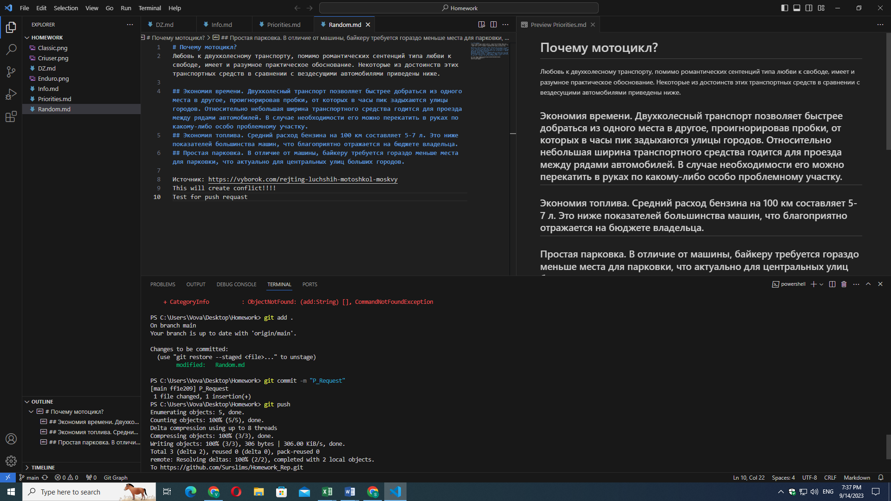
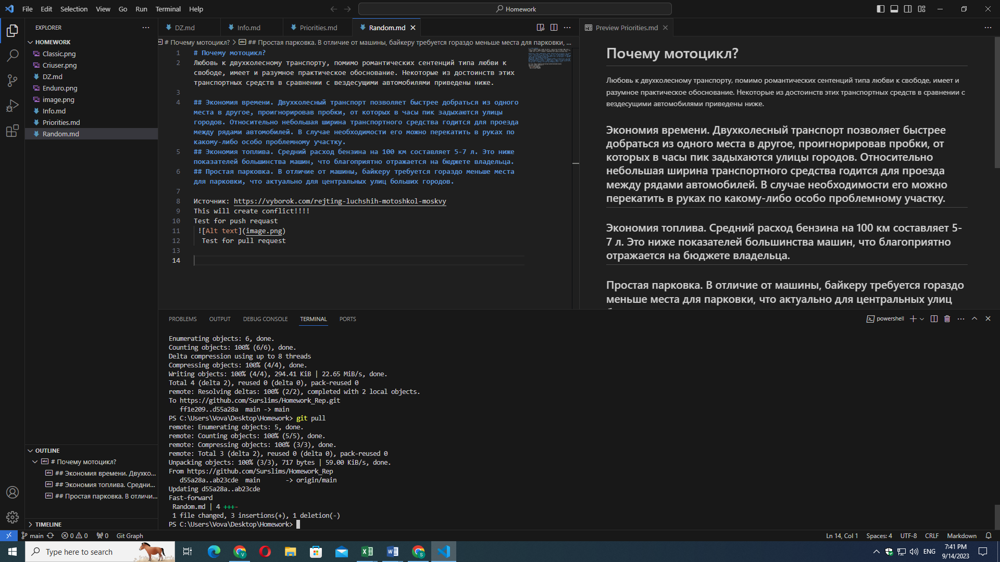
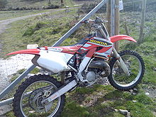

Мотоцикл
Мотоци́кл (фр. motocycle, от лат. mōtor — приводящий в движение и греч. κύκλος — круг, колесо) — как правило, двухколёсное (реже — трёхколёсное) транспортное средство с двигателем (внутреннего сгорания, электрическим, пневматическим), главными отличительными чертами которого являются вертикальная посадка водителя (мотоциклиста), наличие боковых ножных упоров (площадок, подножек) и прямое (безредукторное) управление передним поворотным колесом.

Самый первый мотоцикл был придуман инженером Готтлибом Даймлером в 1885 и назывался он Daimler Reitwagen.

Классические мотоциклы включают в себя двухколёсные, двухколёсные с боковой коляской, и трёхколёсные; в начале XXI века стали набирать популярность квадроциклы. Мотоциклы также подразделяются по своей конструкции и размерам: мопеды, мокики (имеют небольшой размер двигателя, как правило до 50 см³) мотороллеры или скутеры (закрытый пластиком двигатель, расположенный под сиденьем водителя и площадки для ног), и собственно мотоциклы различных типов: классические, крузеры, туреры, спортивные, шоссейные, кроссовые, эндуро, чопперы.

## Конструкция
Несущей конструкцией мотоцикла является рама, как правило она выполняется сварной. На раме крепятся все детали: задняя подвеска, топливный бак, вилка с передней подвеской, двигатель и трансмиссия. На вилке располагаются руль и, в большинстве случаев, контрольно-измерительные приборы: спидометр, тахометр, указатель уровнемера топливного бака, термометры масла (для четырехтактных двигателей), охлаждающей жидкости (при наличии водяного охлаждения), уровнемер охлаждающей жидкости. Во всех мотоциклах (кроме электрических, где используются мотор-колёса) крутящий момент передаётся только на заднее колесо, для передачи крутящего момента чаще всего используется цепь, в некоторых вариантах - карданный вал и коническая зубчатая передача, закрытые корпусом для защиты от загрязнения и попадания влаги, ухуджающих свойства смазочных материалов, особенно предназначенных для применения в таких высоконагруженных узлах. На большинстве мотоциклов в качестве трансмиссии используется механическая коробка передач, также возможно использование вариаторов, то есть бесступенчатой передачи, позволяющей осуществлять плавное переключение между скоростями.

## Классический мотоцикл
Мотоциклы этого класса появились первыми и с тех пор являются «мотоциклами на каждый день». Конструкция этих мотоциклов отличается простотой и удобством обслуживания, хотя в современных классических мотоциклах используются многие технологии, пришедшие из спорта. Современный классический мотоцикл может быть любой кубатуры — от 50 до 2000 см³ — но то, что объединяет их все в один тип — это геометрия, обеспечивающая прямую (так называемую «классическую») посадку водителя, когда он сидит ровно, не отклоняясь и не опираясь на руль. Такая посадка весьма удобна для длительной езды, и все мотоциклы создаются с учётом этого. Двигатели классических мотоциклов обычно среднефорсированные для достижения максимального ресурса, который у японских мотоциклов составляет 100 000 км и более.

## Крузер
Крузер — стиль мотоциклов, сформированный в большей части благодаря компании «Harley-Davidson», которая специализируется на выпуске мотоциклов этого класса (изначально и до сих пор большая часть модельного ряда Harley-Davidson состоит из крузеров и туреров).
Harley-Davidson FLSTF Fatboy
С тех пор и по сей день крузеры сохраняют свои элементы стиля и особенности конструкции

## Эндуро
Название класса от английского слова endurance — выносливость. Это класс мотоциклов, предназначенный для езды по плохим дорогам, а то и вовсе бездорожью. В зависимости от специализации выделяют несколько типов, которые имеют общие характеристики.

Ссылка на источник https://ru.wikipedia.org/wiki/%D0%9C%D0%BE%D1%82%D0%BE%D1%86%D0%B8%D0%BA%D0%BB
